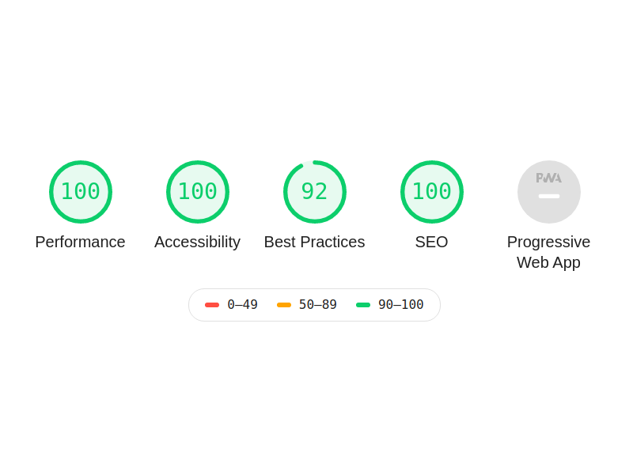

  
 

# Hi, i'm Diogo.

 

🚀 I'm a **full-stack** developer.

This page was created to publicize the **skills** that I developed and to return to society part of the **knowledge** I acquired.

### Welcome to my little big universe!

## Lighthouse Audit Score

    

This website was developed with **GastsbyJS**, **ReactJS**, **NodeJS** and **GraphQL**.

## Author

[Diogo Ferreira](https://diogodeveloper.netlify.com/)

## License

This project is open source and available under the [MIT License](LICENSE).

  
# Support me

